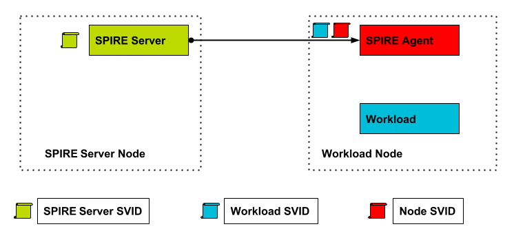
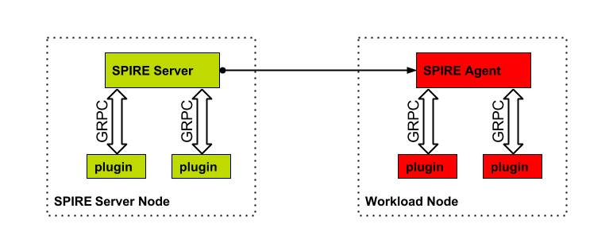

# SPIRE Plugin Development 

SPIRE has an extensible plugin architecture, allowing both the SPIRE Agent and SPIRE Server to implement solutions for specific use cases. The following section enumerates the different supported plugin types and their usage:

<table>
  <tr>
    <td>Term</td>
    <td>Description</td>
  </tr>
  <tr>
    <td>SPIRE</td>
    <td>SPIRE (the SPIFFE Runtime Environment) is a software system that exposes an API (the SPIFFE Workload API) to other running software systems (workloads) so they can retrieve their identity, as well as documents (SVIDs) to prove it to other workloads, at run-time. This proof of identity can then be used as the primary authentication mechanism for a workload when accessing other systems.</td>
  </tr>
  <tr>
    <td>SPIRE Agent</td>
    <td>A daemon process running on the same kernel as the workloads and exposes SPIFFE Workload API, which the workloads call to request their identity. </td>
  </tr>
  <tr>
    <td>SPIRE Server </td>
    <td>A daemon process which maintains a registry of workload identities and corresponding attestation policies. SPIRE Agents connect to SPIRE Server to retrieve list of workload identities that they are entitled to issue, as well as the corresponding SVIDs.</td>
  </tr>
  <tr>
    <td>Plugin</td>
    <td>A separate external process that communicates over a gRPC socket and extends functionality not available through builtin SPIRE Agent and SPIRE Server plugins.</td>
  </tr>
  <tr>
    <td>Base SVID</td>
    <td>The SVID assigned to the node where a SPIRE Agent is running. The attestation happens during bootstrap. The Base SVID is used by the SPIRE Agent for all subsequent communication after attestation. </td>
  </tr>
</table>

This document will walk a developer through the process developing of a plugin for SPIRE, using a specific example plugin from our [plugin template project](https://github.com/spiffe/plugin-template). By the end of the tutorial a developer should be able to

1. Create a skeleton Plugin project.

2. Implement a specific type of Plugin interface for either a SPIRE Agent or SPIRE Server.

3. Run and Test the plugin locally.

4. Optinally create a PR for the Plugin

5. Deploy and configure in their local SPIRE deployment 

# TOPOLOGY
 

A SPIRE deployment consists of a SPIRE Server and a number of SPIRE Agents. A SPIRE Agent will be installed on each managed node in a Trust Domain. Once bootstrapped, the SPIRE Agent receives a Base SVID from SPIRE Server, which is used from that point on for authentication against the SPIRE Server.

The SPIRE Agent is responsible for attesting workloads running on the Node it is responsible for. 

# SPIRE Server

The SPIRE Server is responsible for maintaining a set of selector policies that will be used by SPIRE Agents to attest the identity of a workload.  The SPIRE Server is responsible for storing and managing those policies.  

The SPIRE Server is also responsible for signing CSR requests from SPIRE Agents and providing them with CA certificates.

<table>
  <tr>
    <td>Plugin</td>
    <td>Description</td>
  </tr>
  <tr>
    <td>CA </td>
    <td>Responsible for processing CSRs requested by SPIRE Agents. Also responsible for generating CSR for intermediate signing cert and storing the related keys.</td>
  </tr>
  <tr>
    <td>DataStore </td>
    <td>Responsible for providing a registry to store workload identities and attestation policies</td>
  </tr>
  <tr>
    <td>Node Attestor</td>
    <td>Responsible for attesting the identity proof of a node; works in conjunction with SPIRE Agent’s Node Attestor plugin. These plugins are dependent on the environment the SPIRE Agent and SPIRE Server are running in. </td>
  </tr>
  <tr>
    <td>Node Resoler </td>
    <td>Responsible for resolving platform specific dynamic node Identifier and mapping them to identifiers used in attestation policies.</td>
  </tr>
  <tr>
    <td>Upstream CA </td>
    <td>Responsible for processing CSR requests for intermediate signing certs used to sign SVID certificates. Can be used to integrate with an existing PKI system.</td>
  </tr>
</table>

# SPIRE Agent

SPIRE Agent is made up of three different plugins that allow the agent to bootstrap itself to the SPIRE Server and attest workloads that are assigned to run on the corresponding node. The SPIRE Agent has a cache of all the workload selectors it is responsible for. 

<table>
  <tr>
    <td>Plugin</td>
    <td>Description</td>
  </tr>
  <tr>
    <td>Key Manager </td>
    <td>Responsible for generating and persisting Public-Private key pair used for the Base SVID of the SPIRE Agent.
</td>
  </tr>
  <tr>
    <td>Node Attestor</td>
    <td>Responsible for providing a platform-specific proof of identity of the node.
</td>
  </tr>
  <tr>
    <td>Workload Attestor</td>
    <td>Responsible for attesting the workload. When called, it returns the selectors associated with the Workload. The agent supports loading of multiple Workload Attestors. When a Workload has satisfied a set of attestation policies, it is assigned corresponding SVID</td>
  </tr>
</table>

# PLUGINS

SPIRE adopts [go-plugin](https://github.com/hashicorp/go-plugin) as its plugin framework. SPIRE’s plugin interfaces are implemented using [gRPC](https://grpc.io/), this allows plugin to be implemented in different supported languages. The gRPC service definition and message body for each of the plugins is specified as protocol buffer [here](https://github.com/spiffe/spire/tree/master/proto).

The SPIRE core repository default plugin implementations are written in Go for each plugin type . The core repo also includes the compiled generated protocol buffer code. For other languages you will need to use specific protocol buffer compilers to generate the code accordingly. This guide provides a walkthrough for developing a plugin in Go. 

# Environment Setup 

1. Setup your [go development environment](https://golang.org/doc/install), if you don’t already have one. We have used go 1.9 and higher for all internal plugin development.

2. Follow the instructions in the [Getting started](https://github.com/spiffe/spire#getting-started) section to install and configure SPIRE. We will need a running setup to test the plugin.

# PLUGIN Development

The SPIRE plugin implementation needs to satisfy the interface methods specified for the plugin type. The [plugin-template](https://github.com/spiffe/plugin-template) github repository is setup with the archetype plugin code. 
Let’s walk through an example to create a [keymanager](https://github.com/spiffe/spire/blob/master/proto/agent/keymanager/keymanager.proto) plugin type from the archetype code. We will name the example plugin custom-keymanager. 

## Setup Environment Variables

Setup environment variables that will be used throughout  the example 

	export SPIRE_HOME=/opt/spire
	export GITHUB_USER=<your_github_username>
	mkdir ${SPIRE_HOME}

## Create Plugin Project

1. Create a directory ‘spiffe’ in your Go workspace and clone the [plugin-template](https://github.com/spiffe/plugin-template) repo:
	
		mkdir -p $GOPATH/src/github.com/spiffe/
		mkdir $GOPATH/src/github.com/${GITHUB_USER}
		cd  $GOPATH/src/github.com/spiffe/
		git clone https://github.com/spiffe/plugin-template.git

2. Create a separate directory for the new plugin project custom-keymanager. We recommend using the following path:

		mkdir $GOPATH/src/github.com/${GITHUB_USER}/custom-keymanager

3. Copy files from the cloned spiffe/plugin-template directory into custom-keymanager directory
		
		cp -R $GOPATH/src/github.com/spiffe/plugin-template/* $GOPATH/src/github.com/${GITHUB_USER}/custom-keymanager/

4. We recommend creating a separate repo for the plugin, follow [instructions](https://help.github.com/articles/adding-an-existing-project-to-github-using-the-command-line/) to init a github repo.

## Setup Plugin Skeleton Code

1. Change your current working directory to custom-keymanager directory:

		cd $GOPATH/src/github.com/${GITHUB_USER}/custom-keymanager

3. Edit plugin.go file to import the keymanager plugin package. Only leave the keymanager import statement and delete other plugin package imports, leave the uncommented package imports as is do not delete them:

		"github.com/spiffe/spire/proto/agent/keymanager"

3. Set the pluginName const to custom_keymanager:

		const pluginName  = "custom_keymanager"

4. Define the receiver type struct which will implement the KeyManager Interface. Rename the struct Plugin in plugin.go as  CustomKeyManager:

		type CustomKeyManager struct { // Rename Plugin Receiver Type*
		   cryptoAlgo string
		}

5. Update the New() method in plugin.go to return *CustomKeyManager type:

		func New() *CustomKeyManager{
		 	return &CustomKeyManager{}
		}

6. To Generate CustomKeyManager method stubs that satisfy the KeyManager plugin interface, we use the [impl](https://github.com/josharian/impl) tool. Install the impl tool by running the following command:

		go get github.com/josharian/impl

7. The KeyManager plugin interface is defined under [proto/agent/keymanager](https://github.com/spiffe/spire/blob/7304fb82a905a4988b24de46720178953aad0451/proto/agent/keymanager/interface.go#L21) directory. Run the following commands to generate the method stubs for the CustomKeyManager receiver struct:

		go get github.com/spiffe/spire/proto/agent/keymanager
		impl -dir $GOPATH/src/github.com/spiffe/spire/proto/agent/keymanager 'c *CustomKeyManager' keymanager.KeyManager

8. Copy the generated method stubs for CustomKeyManager from the console output into plugin.go file.

## Plugin main() method

All go-plugin implementations are separate binaries and require a main method that calls the plugin.Serve() method:

1. plugin.Serve() method serves the plugin configured through ServerConfig type which is passed as an argument. The serverConfig consists of a map of pluginName to PluginType (map[string]Plugin). Uncomment the map entry for the KeyManager plugin type in plugin.go main() method and delete other entries.

2. ServerConfig also consists of a Handshake config, uncomment the Handshake config for the keymanager plugin:

		func main() {
			plugin.Serve(&plugin.ServeConfig{
				  	Plugins: map[string]plugin.Plugin{
						pluginName: keymanager.KeyManagerPlugin{KeyManagerImpl: New()},
					},
					HandshakeConfig: keymanager.Handshake,
					GRPCServer: plugin.DefaultGRPCServer,
			})
		}

## Configuration 

PluginData Configuration: Plugin implementations may optionally require configurations to be passed at runtime.

PluginData is a configuration string in the plugin config file. This string is passed to the plugin by calling the Configure method during plugin initialization. ( All plugin interfaces define a Configure method ). It is up to the Configure method implementation to parse PluginData string, should it be formatted.
For our example customkeymanager plugin, we configure the type of cryptographic algorithm. We define the PluginData string to be a [HCL](https://github.com/hashicorp/hcl) compatible key = value list in the plugin config file: (The complete plugin config file for the example is show in the next section) 

1. Add the following import statements in plugin.go:

		"github.com/hashicorp/hcl"
		“fmt”

2. In the plugin.go file replace PluginConfig struct type with the following CustomKeyManagerConfig struct type, which will be populated with configuration data through the Configure method:
		
		type CustomKeyManagerConfig struct{
			CryptoAlgo string `hcl:"crypto_algo"`
		}

3. Implement the Configure method using the hcl.[Parse](https://godoc.org/github.com/hashicorp/hcl#Parse) and hcl.[DecodeObject](https://godoc.org/github.com/hashicorp/hcl#DecodeObject) methods to populate the CustomKeyManagerConfig struct:
		
		func(c *CustomKeyManager) Configure(req *spi.ConfigureRequest) (*spi.ConfigureResponse, error) {
			resp := &spi.ConfigureResponse{}
			// Parse HCL config payload into config struct
			config := &CustomKeyManagerConfig{}
			hclTree, err := hcl.Parse(req.Configuration)
			 if err != nil {
			          err := fmt.Errorf("Error parsing custom keymanager configuration: %s", err)
			          return resp, err
			        }
			err = hcl.DecodeObject(&config, hclTree)
			if err != nil {
			   err := fmt.Errorf("Error decoding custom keymanager configuration: %v", err)
			   return resp, err
			 }
			c.cryptoAlgo = config.CryptoAlgo
			return &spi.ConfigureResponse{}, nil
		}

## Compiling the Plugin

Once you have implemented all the required method to satisfy the KeyManager plugin we can test/run the plugin with SPIRE. The default Makefile from the plugin-template repo provides the necessary make target to build/test the plugin binary:

1. Install goreleases and glide tools:

		make utils

2. Initialize glide package management tool for your plugin project by running the following command:

		glide init

3. Get all the dependencies for your plugin project using glide:

		glide up

4. Build the custom-keymanager binary by running make build:

		make build

## Configure SPIRE 

Both SPIRE Agent and SPIRE Server during bootstrap, read plugin config files in the respective ${SPIRE_HOME}/conf/agent/plugin and ${SPIRE_HOME}/conf/server/plugin directories by default, pluginDir configuration can be used changed to specify a different directory. 

1. Copy the custom-keymanager binary into GOPATH/bin:

		cp $GOPATH/src/github.com/${GITHUB_USER}/custom-keymanager/custom-keymanager $GOPATH/bin

2. Create a config file custom-keymanager.hcl with the following content in the ${SPIRE_HOME}/conf/agent/plugin directory:

		pluginName = "customkeymanager"
		pluginCmd = "$GOPATH/bin/custom-keymanager"
		pluginChecksum = ""
		enabled = true
		pluginType = "KeyManager"
		PluginData  {
		    crypto_algo = "ecdsa"
		}

The following table describes the plugin configurations:

<table>
  <tr>
    <td> Configuration   </td>
    <td>Description</td>
  </tr>
  <tr>
    <td>pluginName</td>
    <td>A unique name that describes the plugin</td>
  </tr>
  <tr>
    <td>pluginCmd</td>
    <td>Path to the plugin binary</td>
  </tr>
  <tr>
    <td>pluginChecksum</td>
    <td>An optional sha256 of the plugin binary </td>
  </tr>
  <tr>
    <td>pluginType</td>
    <td>The plugin type</td>
  </tr>
  <tr>
    <td>enabled </td>
    <td>Boolean specifying if the plugin should be enabled.</td>
  </tr>
  <tr>
    <td>pluginData</td>
    <td>Plugin-specific configuration</td>
  </tr>
</table>

3. There can only be one KeyManager pluginType configured for the SPIRE Agent, otherwise you will see this error:
		
		ERRO[0000] Expected only one key manager plugin, found %!i(int=2) 

 

4. After placing the plugin config in the pluginDir,start the SPIRE Agent to initialize the custom-keymanager plugin:

		cd  ${SPIRE_HOME}/
		./spire-agent run &

5. Verify that the plugin was started and configured, the debug log msg should show:

		..."Starting KeyManager plugin: custom_keymanager" subsystem_name=catalog
		…..
		..."Configuring KeyManager plugin: custom_keymanager" subsystem_name=catalog

# HOW TO SUBMIT YOUR PLUGIN:

If you wish for the plugin be included in the SPIFFE curated plugins, create an [issue](https://github.com/spiffe/spire/issues/new) under the SPIRE project and include the following information, make sure to add the label ‘**_New Plugin_**’ to your issue:

	pluginName:< name of the plugin >
	pluginType:< type of plugin >
	description: < brief description of how the plugin works >
	pluginData: < explain each plugin specific configurations, include example configurations >
	Github Repo: Link to your plugin github repository 

Once approved, a new repository for the plugin will be created under the [SPIFFE](https://github.com/spiffe) open source organization.

# CONCLUSION

This tutorial has shown how to create and test a new Plugin for SPIRE. Hope this was helpful, please feel free ping us on the SPIRE [slack channel](https://spiffe.slack.com/messages/C7XDP01HB) if you have any further questions.

